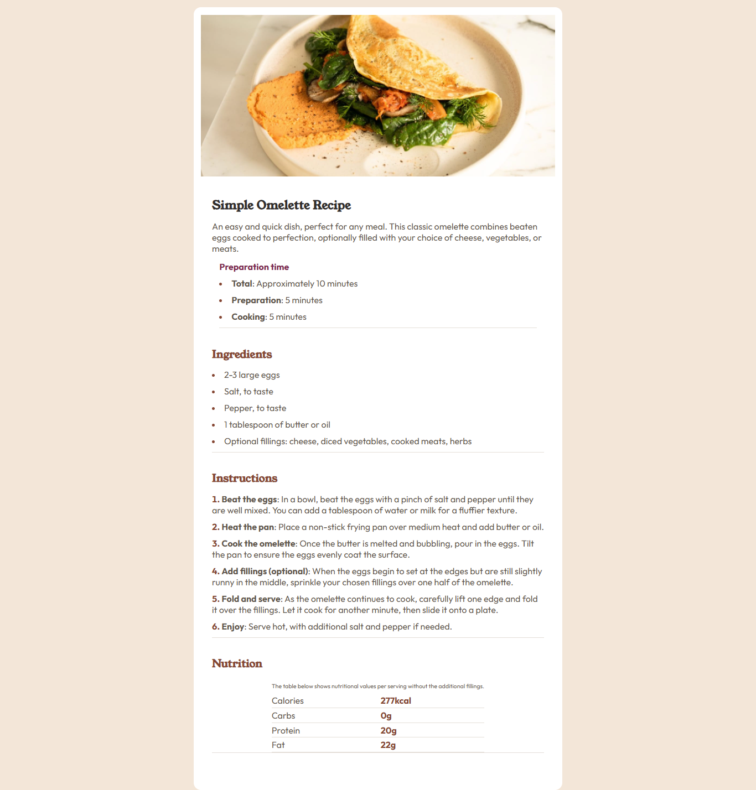

# Frontend Mentor - Recipe page solution

This is a solution to the [Recipe page challenge on Frontend Mentor](https://www.frontendmentor.io/challenges/recipe-page-KiTsR8QQKm). Frontend Mentor challenges help you improve your coding skills by building realistic projects. 

## Table of contents

- [Overview](#overview)
  - [The challenge](#the-challenge)
  - [Screenshot](#screenshot)
  - [Links](#links)
- [My process](#my-process)
  - [Built with](#built-with)
  - [What I learned](#what-i-learned)
  - [Continued development](#continued-development)
  - [Useful resources](#useful-resources)
- [Author](#author)

## Overview

### Screenshot

### Links

- Solution URL: [Solution](https://your-solution-url.com)
- Live Site URL: [Live Site](https://your-live-site-url.com)

## My process

### Built with

- Semantic HTML5 markup
- CSS custom properties
- Flexbox
- Mobile-first workflow

### What I learned

I used breakpoints inside CSS, learned how to connect the borders of the table and used semantic HTML in the entire page. 

### Continued development

I want to use more device breakpoints to make my pages fully responsive.

### Useful resources

- [MDN Device Breakpoints](https://www.w3schools.com/howto/howto_css_media_query_breakpoints.asp) - To add breakpoints inside CSS
- [MDN Table Sizes](https://www.w3schools.com/html/html_table_sizes.asp) - To make the 
 tag full size on the table

## Author

- Website - [Giovani Oliveira](https://giodosvani.dev.br)
- Frontend Mentor - [@giodsovani](https://www.frontendmentor.io/profile/giodosvani)
